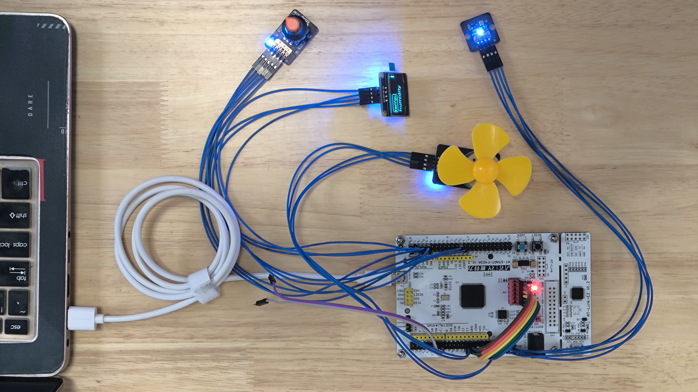

# Demo_CMSIS-FreeRTOS_FatFs_LVGL

## Board
- AT_START_F403A (Arterytek)

## Module
- 0.96' OLED
- rotary encoder
- DC brushed motor
- temperature and humidity sensor

## Development Tool
- Keil MDK

## Brief Introduction

### HMI 
- 旋转编码器和0.96' OLED显示屏提供人机交互.图形库选择LVGL。

### Data Collection
- 温湿度传感器通过IIC协议提供温湿度数据。MCU的ADC外设采集电压数据。

### Storage
- 板上有一颗SPI FLASH并且它被FatFS格式化为FAT16文件系统。

### Control
- 通过旋转编码器可以调节风扇(直流有刷电机)速度。风扇的速度等级表为{-5,-4,-3,-2,-1,0,1,2,3,4,5},负数代表逆时针转动，0表示停止转动，正数代表顺时针转动。

### USB
- MCU的USBFS外设枚举为MSC+HID复合设备类，也就是说它既有类似U盘的功能也有类似游戏手柄的功能。

## Execution Flow

## Demo Video
- <https://b23.tv/F3qBbdW> Note：这个视频是最新的，虽然它只展示了与CMSIS-RTX版本不同的地方

- <https://b23.tv/odG8ys0> Note：这个视频是使用CMSIS-RTX的旧版本
